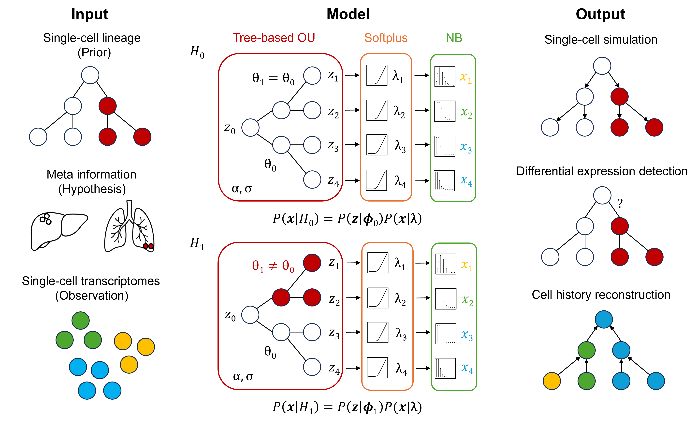

# SingleCellStochastics

This repository provides tools for stochastic modeling and analysis of single-cell gene expression dynamics along cell lineages, particularly supporting the detection of significant gene expression changes on metastatic branches within a metastatic cancer cell lineage via likelihood ratio test. We also provide some simulation tools used to evaluate the model.

The model is composed of a tree-based Ornstein-Uhlenbeck process and a negative binomial observation model. The likelihood is approximated by mean-field variational inference. 

<div style="text-align: left;">
  
</div>

## Motivation
Single-cell gene expression evolves dynamically along cell division histories. However, most existing single-cell methods treat cells as static snapshots, neglecting the rich information encoded in their underlying lineage structures. Recent advances in single-cell lineage tracing, including the CRISPR-based barcoding, now enable the reconstruction of high-resolution lineage phylogenies, providing a natural framework pinpoint exactly when and where transcriptional changes occur. This capability is fundamental to decoding the dynamics of development, differentiation, and disease progression. To fully leverage this lineage information, we present a flexible probabilistic framework that models stochastic single-cell gene expression over inferred cell lineage trees. By grounding gene expression analysis in explicit cell lineage phylogenies with topology and branch lengths, our model enables the inference of continuous expression dynamics, despite the high sparsity and low coverage of sequencing data. By providing a rigorous foundation for modeling sparse count data on latent tree structures, this model establishes a generalizable framework that naturally extends to multi-gene programs, lineage uncertainty, and multi-modal integration, paving the way for a comprehensive atlas of single-cell stochastic dynamics.

## Installation
We have made the package pip installable, but not yet available publicly on pypi, so users must install locally by cloning this repo and then within the repo (and prefereably within a clean and isolated environment) running:
```
pip install -e .
```

Once installed, you can check for the executable with:
```
which run-ou-poisson
```

## Run example
The model requires three input data: a lineage tree, a gene expression read count file matching the tree leaves, and a regime file with cell labels on the tree. 
The model tests for the significance of gene expression changes for the regime labels compared to the null label. In the bash terminal, run the following as an example:
```
run-ou-poisson --tree examples/input_data/tree.nwk --expr examples/input_data/readcounts.tsv --regime examples/input_data/regime.csv --null 0 --output examples/output_results/
```
The result contains a hypothesis test for each gene, including the estimated model parameters and a -log likelihood for the null (h0) and alternative (h1) hypotheses, respectively. 
The p-values are converted to q-values with the FDR control through the Benjamini-Hochberg procedure. The significance is determined by a threshold of 0.05 for the q-values.

It is also possible to run the python directly from `singlecellstochastics/oup.py` by replacing `run-ou-poisson` in the commands above with `python -m singlecellstochastics.oup`.
Users can also import specific functions within a python interactive terminal such as `from singlecellstochastics.lrt import likelihood_ratio_test` or other functions that one needs to access.

## Model parameters

### Required parameters
These parameters are required to run the model:

`--tree`: input tree inferred from single-cell lineage tracing. Each leaf represents a cell. 

`--expr`: input gene expression read count file (cells x genes). Each row matches a leaf from the input tree; each column represents a gene expression raw read count. 
Read counts should not be log transformed, as the model explicitly models the single-cell overdispersion with negative binomial observation models.

`--regime`: input labels (e.g., metastatic tissues) for each node on the tree, including the root, all internal nodes, and leaves. 
The model can take two formats of regime files: a file with a node column and a label column if all nodes are named in the tree file, or a file with two leaf columns and a label column where nodes are represented by the MRCA of two leaves.

`--null`: input label for the null hypothesis. In the case of cancer metastasis, this label could be the primary tumor, and the model could be used to detect differential expression of tissue-specific metastasis.

*The model can also take multiple input files separated by a comma. The model will consider the average likelihood for all inputs in this case. This could be helpful to pull information across multiple trees from the same tumor or multiple genes from the same gene set.

### Optional parameters
These parameters control model behaviors and are optional:

`--library`: a scale factor on library size for each cell. It is recommended to have this input for real datasets in order to reduce the gaps due to different sequencing depths. 
The library size should be calculated as the total gene read counts normalized by the mean library size among all cells, so as to maintain a similar scale. Default does not use a library size.

`--resume`: set to true to resume batch running from a previous log. A log file should be present in the current directory. Default starts over.

`--outdir`: output directory for the result. Default is the current directory.

`--prefix`: prefix label for the output file. Default is "result".

`--annot`: gene annotation file for the output. Default is the same as the input expression file.

`--batch`: batch size (gene numbers) for running the model. Must not be larger than the number of genes. Larger batch size enables parallelization and improves efficiency; smaller batch size prevents exceeding the memory limit. Default is 1000 genes.

`--lr`: learning rate for Adam optimizer. Larger learning rate makes faster convergence; smaller learning rate prevents divergence. Default is 0.1.

`--iter`: maximal number of iterations for optimization. Increase the limit if genes do not converge yet. Default is 10,000 iterations.

`--window`: window size (iteration numbers) to check for convergence. Convergence is determined by the relative loss decrease at the beginning and the end of the last window. Default is 200 iterations.

`--tol`: tolerance to check for convergence. Convergence is determined by a smaller relative loss decrease within the last window compared to the tolerance. Increase the tolerance if convergence is too strict. Default is 1e-4.

`--wandb`: to specify a run name for wandb. Wandb can record and visualize the loss history during optimization. Default does not run wandb.

### Developer parameters
These parameters are for model developers and changes on them are generally not needed:

`--approx`: approximation approaches for the likelihood expectation in ELBO. "softplus_MC" uses a softplus transformation with Monte Carlo simulation for approximation;
"softplus_taylor" uses softplus with Taylor series for approximation; "exp" uses exponential instead of softplus. Default uses "softplus_MC". 

`--no_kkt`: set to true to calculate OU likelihood without the Karush-Kuhn-Tucker (KKT) constraint. The KKT condition helps to reduce free parameters in OU and only optimizes for alpha. Default uses KKT for OU.

`--no_nb`: set to true to use Poisson instead of negative binomial as the observation model. Negative binomial has an additional dispersion parameter compared to Poisson. Default uses negative binomial that better fits single-cell data.

`--em_iter`: number of iterations for EM algorithm. Default optimizes all parameters without using EM.

`--sim_all`: number of simulations for an empirical null distribution instead of chi-squared. Simulate the same null distribution for all genes using swapped OU parameters. Default does not use empirical simulation.

`--sim_each`: number of simulations for empirical null distributions instead of chi-squared. Simulate a different null distribution for each gene using each inferred OU parameters. Default does not use empirical simulation.

`--pseudo`: pseudocount for adding to raw reads in order to reverse softplus as initial mean values at leaves. Default does not add a pseudocount for reverse softplus.

`--init`: set to true to initialize OU parameters with a simple OU model. Default uses 1.0 as initial values.

`--prior`: L2 regularization strength for log alpha. Equivalently, the precision of the Gaussian prior. Default is 1.0.

`--grid`: a maximal value for grid search of alpha while fixing other parameters. This could help to visualize the sensitivity of the -log likelihood to the alpha parameter. Default does not perform grid search.

`--dtype`: data type for tensors. Set to float32 under limited memory. Default uses float64.

## Simulations

### Lineage simulation

Example cell lineages can be simulated with a modified version of the agent-based cancer cell simulator from [MACHINA](https://www.nature.com/articles/s41588-018-0106-z). 

Create and activate the required conda environment with `Lineage_simulation/env/lineage_sim.yml`:
```
conda env create -n simulate -f Lineage_simulation/env/lineage_sim.yml
conda activate simulate
```

To compile the C++ code:
```
cd Lineage_simulation
rm -r build
mkdir build
cd build
cmake ..
make
```

The sim folder contains an example `color.txt` file for `simulate`. Run an example simulation:
```
build/simulate -C 100 -c sim/color.txt -m 1 -mig 1e-2 -K 1000 -f 1 > sim/m1_mig1e-2_K1e3_f1.log
```
This will output a log file, `cellDivisionHistory.txt` (generation, parent cell, child cell), `cloneCells.txt` (clone site, {clone mutations}, clone cells), and `migrationCells.txt` (cells migrating to other sites). 

Alternatively, clone the original [MACHINA repo](https://github.com/raphael-group/machina) and modify code from `machina/src/simulation` based on `Lineage_simulation/src`. Compile and run the simulation by following the instructions from MACHINA.

Then, sample cells from the simulation and build a cell lineage tree using `cell_lineage.py`. It takes clonal cells, migration cells, and cell division history from simulation, samples cells from each clone with a proportion (default p=1.0, using all simulated cells), and coalesces them into a cell lineage tree, along with a regime file indicating migration sites along the lineage. An example of a cell lineage tree by sampling 30% of simulated cells:
```
python cell_lineage.py --cells sim/cloneCells.txt --division sim/cellDivisionHistory.txt --migration sim/migrationCells.txt --proportion 0.3
```
There are two formats of regime files: either two columns with all nodes and corresponding labels as in `lineage_simulation/regime.csv`, or three columns with pairs of leaves indicating nodes at MRCA and an additional column for labels as in `lineage_simulation/regime_mrca.csv`.

### Stochastic simulation
`stochastic_simulation/data` contains input files for simulations, including a Newick tree file from lineage simulation and regime files indicating tissue labels on the tree. 

The model takes the tree and regime as input, and simulates gene expression read counts with Ornstein-Uhlenbeck process along the tree. Simulated read counts and illustrations of stochastic processes are generated in `stochastic_simulation/sim`. Example simulations were produced from the following command:
```
run-stochas-sim --tree data/tree.nwk --regime data/regime_root.csv --test 1 --root 0 --optim 1 --sigma 1 --alpha 3 --out sim/500_NB0.5_a3_s1 --label root0-1 --dispersion 0.5
```

